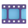

# OpenBurningSuite Icon Reference

Maps OpenBurningSuite features/views to icons in this collection.  
Stems below; append size + extension: `<stem>-<size>.png` or `ico/<stem>.ico`.

## View / Navigation Icons

| OBS View | Stem | .ico | 32x32 |
|---|---|---|---|
| Home / App | `icons8-cd-3d` | `ico/icons8-cd-3d.ico` |  |
| Write (Burn) | `icons8-cd-3d` | `ico/icons8-cd-3d.ico` |  |
| Read (Rip) | `fluentui-optical-disk` | `ico/fluentui-optical-disk.ico` |  |
| Build (ISO) | `fluentui-optical-disk` | `ico/fluentui-optical-disk.ico` |  |
| Audio Wizard | `icons8-music-3d` | `ico/icons8-music-3d.ico` |  |
| Video Wizard | `icons8-video-editing-3d` | `ico/icons8-video-editing-3d.ico` |  |
| Game Wizard | `icons8-game-controller` | `ico/icons8-game-controller.ico` |  |
| Copy Wizard | `icons8-copy-2d` | `ico/icons8-copy-2d.ico` |  |
| Blank/Erase | `icons8-erase` | `ico/icons8-erase.ico` |  |
| Verify | `fluentui-check-mark-button` | `ico/fluentui-check-mark-button.ico` |  |
| Discover | `icons8-discover-2d` | `ico/icons8-discover-2d.ico` |  |
| Settings | `icons8-settings-2d` | `ico/icons8-settings-2d.ico` |  |
| Help | `fluentui-information` | `ico/fluentui-information.ico` |  |

## Operations / Actions

| Action | Stem | .ico | 32x32 |
|---|---|---|---|
| Burn / Write | `icons8-cd-3d` | `ico/icons8-cd-3d.ico` |  |
| Read / Rip | `fluentui-optical-disk` | `ico/fluentui-optical-disk.ico` |  |
| Build / Create | `icons8-create` | `ico/icons8-create.ico` |  |
| Copy Disc | `icons8-copy-2d` | `ico/icons8-copy-2d.ico` |  |
| Verify | `fluentui-check-mark-button` | `ico/fluentui-check-mark-button.ico` |  |
| Erase / Blank | `icons8-erase` | `ico/icons8-erase.ico` |  |
| Eject | `icons8-eject-2d` | `ico/icons8-eject-2d.ico` |  |
| Speed | `icons8-speed-2d` | `ico/icons8-speed-2d.ico` |  |
| Multi-Copy | `icons8-duplicate-2d` | `ico/icons8-duplicate-2d.ico` |  |
| Refresh / Rescan | `icons8-refresh` | `ico/icons8-refresh.ico` |  |
| Export | `icons8-export-2d` | `ico/icons8-export-2d.ico` |  |
| Save | `icons8-save` | `ico/icons8-save.ico` |  |
| Open File | `fluentui-open-file-folder` | `ico/fluentui-open-file-folder.ico` |  |
| Add File | `icons8-add-file` | `ico/icons8-add-file.ico` |  |
| Delete | `icons8-delete-2d` | `ico/icons8-delete-2d.ico` |  |
| Cancel / Stop | `icons8-stop-2d` | `ico/icons8-stop-2d.ico` |  |
| Pause | `icons8-pause-2d` | `ico/icons8-pause-2d.ico` |  |
| Simulation | `icons8-test-passed` | `ico/icons8-test-passed.ico` |  |

## Disc / Media Types

| Type | Stem | .ico | 32x32 |
|---|---|---|---|
| CD-R/RW | `icons8-cd-3d` | `ico/icons8-cd-3d.ico` |  |
| DVD±R/RW | `fluentui-dvd` | `ico/fluentui-dvd.ico` |  |
| Blu-ray | `icons8-blu-ray-2d` | `ico/icons8-blu-ray-2d.ico` |  |
| M-DISC | `icons8-cd-3d` | `ico/icons8-cd-3d.ico` |  |

## Image File Formats

| Format | Stem | .ico | 32x32 |
|---|---|---|---|
| ISO / BIN/CUE / NRG / MDF | `fluentui-optical-disk` | `ico/fluentui-optical-disk.ico` |  |
| CCD / IMG / TOC / CDI | `fluentui-optical-disk` | `ico/fluentui-optical-disk.ico` |  |

## Audio Features

| Feature | Stem | .ico | 32x32 |
|---|---|---|---|
| Audio CD | `icons8-music-3d` | `ico/icons8-music-3d.ico` |  |
| CD-TEXT | `fluentui-musical-note` | `ico/fluentui-musical-note.ico` |  |
| Rip Audio | `fluentui-optical-disk` | `ico/fluentui-optical-disk.ico` |  |
| WAV output | `icons8-wav-2d` | `ico/icons8-wav-2d.ico` |  |
| Playlist (M3U/PLS) | `icons8-playlist-3d` | `ico/icons8-playlist-3d.ico` |  |
| Headphones | `icons8-headphones-2d` | `ico/icons8-headphones-2d.ico` |  |
| Volume | `fluentui-speaker-high-volume` | `ico/fluentui-speaker-high-volume.ico` |  |

## Video Features

| Feature | Stem | .ico | 32x32 |
|---|---|---|---|
| DVD-Video (VIDEO_TS) | `icons8-video-editing-3d` | `ico/icons8-video-editing-3d.ico` |  |
| Blu-ray BDMV | `icons8-video-editing-3d` | `ico/icons8-video-editing-3d.ico` |  |
| Timeline / Chapters | `icons8-timeline-3d` | `ico/icons8-timeline-3d.ico` |  |
| FFmpeg / Transcode | `fluentui-film-frames` | `ico/fluentui-film-frames.ico` |  |

## Gaming Consoles

| Console | Stem | .ico | 32x32 |
|---|---|---|---|
| PlayStation | `icons8-playstation-3d` | `ico/icons8-playstation-3d.ico` |  |
| Nintendo Switch | `icons8-nintendo-switch-2d` | `ico/icons8-nintendo-switch-2d.ico` |  |
| Xbox | `icons8-xbox-2d` | `ico/icons8-xbox-2d.ico` |  |
| Steam Deck | `icons8-steam-deck-2d` | `ico/icons8-steam-deck-2d.ico` |  |
| Atari | `icons8-atari-2d` | `ico/icons8-atari-2d.ico` |  |

## Filesystem / Build

| Feature | Stem | .ico | 32x32 |
|---|---|---|---|
| Bootable (El Torito) | `icons8-cd-3d` | `ico/icons8-cd-3d.ico` |  |
| Folder Tree | `icons8-folder-tree-2d` | `ico/icons8-folder-tree-2d.ico` |  |
| Folder | `icons8-folder` | `ico/icons8-folder.ico` |  |

## Verification / Security

| Feature | Stem | .ico | 32x32 |
|---|---|---|---|
| Checksum (CRC/MD5/SHA) | `fluentui-check-mark-button` | `ico/fluentui-check-mark-button.ico` |  |
| Encryption (AES-256) | `icons8-lock-3d` | `ico/icons8-lock-3d.ico` |  |
| Decrypt | `fluentui-unlocked` | `ico/fluentui-unlocked.ico` |  |
| Password / Key | `fluentui-key` | `ico/fluentui-key.ico` |  |

## Write Modes

| Mode | Stem | .ico | 32x32 |
|---|---|---|---|
| Track-at-Once (TAO) | `fluentui-next-track-button` | `ico/fluentui-next-track-button.ico` |  |
| Build on the fly | `icons8-data-transfer` | `ico/icons8-data-transfer.ico` |  |
| RAW | `icons8-cd-3d` | `ico/icons8-cd-3d.ico` |  |

## Wizard Steps

| Step | Stem | .ico | 32x32 |
|---|---|---|---|
| Welcome / Start | `icons8-wizard-3d` | `ico/icons8-wizard-3d.ico` |  |
| Source Selection | `fluentui-open-file-folder` | `ico/fluentui-open-file-folder.ico` |  |
| Destination | `icons8-cd-3d` | `ico/icons8-cd-3d.ico` |  |
| Settings | `icons8-settings-2d` | `ico/icons8-settings-2d.ico` |  |
| Summary | `fluentui-clipboard` | `ico/fluentui-clipboard.ico` |  |
| Progress | `icons8-progress-indicator-2d` | `ico/icons8-progress-indicator-2d.ico` |  |
| Complete | `fluentui-check-mark-button` | `ico/fluentui-check-mark-button.ico` |  |

## Status / Info

| Status | Stem | .ico | 32x32 |
|---|---|---|---|
| Drive Ready | `fluentui-green-circle` | `ico/fluentui-green-circle.ico` |  |
| Drive Busy | `fluentui-orange-circle` | `ico/fluentui-orange-circle.ico` |  |
| Error | `icons8-error-sign` | `ico/icons8-error-sign.ico` |  |
| Warning | `fluentui-warning` | `ico/fluentui-warning.ico` |  |
| Success | `fluentui-check-mark-button` | `ico/fluentui-check-mark-button.ico` |  |
| Info | `fluentui-information` | `ico/fluentui-information.ico` |  |
| Log / Output | `icons8-console-3d` | `ico/icons8-console-3d.ico` |  |
| Dashboard | `icons8-dashboard-3d` | `ico/icons8-dashboard-3d.ico` |  |
